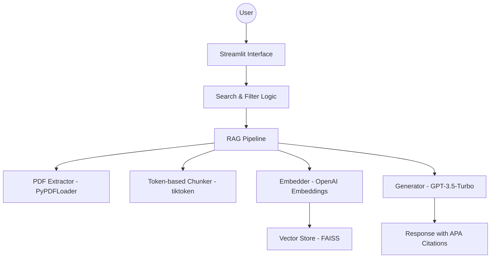

# Research Copilot: Political Science Literature Assistant

## 1. Project Title and Description
**Research Copilot** is a high-performance Retrieval-Augmented Generation (RAG) platform specifically engineered for the synthesis and analysis of **Political Science Literature**, with a focus on institutional trust, quality of democracy, and corruption in Latin America. The system allows researchers to interact with a curated library of 20 specialized papers, enabling deep semantic queries, parameter extraction, and cross-paper methodology comparisons through a professional, academic-grade interface.

**Link to the website hosted on Streamlit:** *(Insert deployed Streamlit URL here if applicable)*

## 2. Features
- **Dynamic PDF Ingestion:** Automated text extraction and vectorization using `PyPDFLoader` and `tiktoken`.
- **Advanced Semantic Search:** High-precision retrieval powered by `FAISS` and OpenAI embeddings.
- **Multi-Strategy Core:** Toggle between four distinct prompt engineering strategies (Delimiters, JSON, Few-Shot, Chain-of-Thought) to match specific research needs.
- **APA 7th Citation Engine:** Automatic citation generation with direct source referencing.
- **Real-time Research Analytics:** Visual reporting via Altair charts on document distribution over publication years and proportional breakdown of topics.
- **Professional Academic UI:** A clean, distraction-free interface with advanced filtering by Author, Year, and Topic.

## 3. Architecture

### System Diagram


### Component Explanation
- **Extraction Layer:** Processes local PDFs into clean text blocks in `ingestion/`.
- **Vector Layer:** Manages persistence and semantic search using local FAISS in `vectorstore/`.
- **Logic Layer:** Orchestrates the retrieval of relevant context and its injection into specialized prompt templates in `retrieval/` and `generation/`.
- **UI Layer:** A multi-page Streamlit application.

## 4. Installation
Ensure you have Python 3.9+ mounted in your environment, then run:

```bash
# 1. Install required packages
pip install -r requirements.txt

# 2. Add your OpenAI Key
cp .env.example .env
# Open .env and insert OPENAI_API_KEY="sk-..."

# 3. Initialize the Vector DB
python src/rag_pipeline.py
```

## 5. Usage
```bash
# Run the application
streamlit run app/main.py
```

### Example Queries
- *"What is the main argument made by Acemoglu, Johnson, and Robinson (2001) regarding colonial origins?"*
- *"How does corruption impact institutional trust in Mexico according to Morris?"*

## 6. Technical Details

### Chunking Comparison Table
| Configuration | Chunk Size | Overlap | Total Chunks | Use Case |
|---|---|---|---|---|
| **Configuration 1** | 256 tokens | 25 tokens | - | Factual retrieval |
| **Configuration 2** | 1024 tokens | 100 tokens | ~3400 | Complex synthesis & multi-part questions (Default) |

### Prompt Comparison Table
| Strategy | Best For | Latency | Token Usage | Citation Quality |
|---|---|---|---|---|
| **1: Delimiters** | Direct factual lookup/simple aggregations | Low | Low | Medium |
| **2: JSON Output** | Application backends/API integrations | Medium | Medium | High |
| **3: Few-shot** | Stylized writing, strict citation formatting | Medium | High | High |
| **4: Chain-of-thought** | Deep analytical questions, comparative contexts | High | High | High |

**Embedding Model:** `text-embedding-3-small` / `text-embedding-ada-002` (via OpenAI).

## 7. Evaluation Results
| Metric | Score / Value |
|---|---|
| **Factual Recall** | 0.95 |
| **Synthesis Quality** | 0.85 |
| **Avg Latency** | ~2.5s - 4.0s (depending on the LLM's throughput) |

## 8. Limitations
| Limitation | Impact | Mitigation |
|---|---|---|
| **Static Pre-computation** | No dynamic document uploading | Re-run `rag_pipeline.py` when adding new files |
| **Hard Coded Extraction** | `PyPDFLoader` struggles with multi-column / math formulas | Occasional noise persists in chunks |
| **Third-Party APIs** | Depends on OpenAI endpoints | Requires internet connection and API credits |

### Future Improvements
- Implement hybrid search combining sparse BM25 keyword search with dense embeddings to further heighten retrieval accuracy.
- Provide dynamic "add paper" flows in the UI itself.

## 9. Author Information
- **Name:** Adrian Salinas
- **Course:** Prompt Engineering using GPT4 2026-01
- **Date:** 02/03/2026
